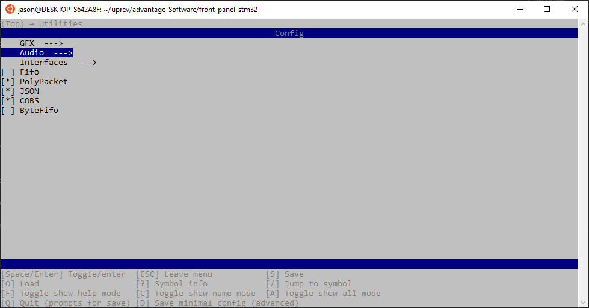
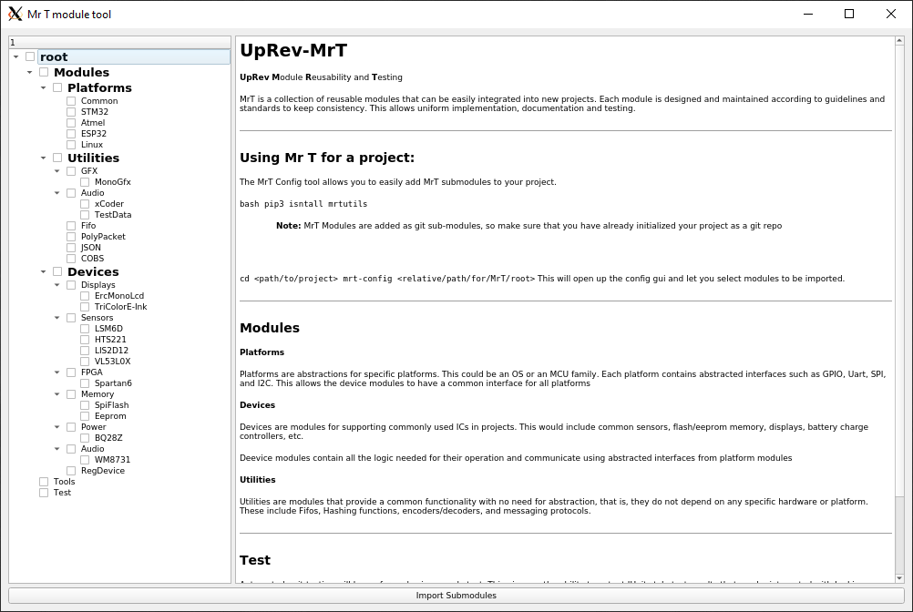

Getting Started 
===============

This section of the document gives a basic overview of installing and using the modules

Installation
------------
The code modules themselves are imported as submodules, so there are no libraries that need to be installed. But there is a toolset ``mrtutils`` which makes it easier to manage the modules. 

.. code-block:: bash

   pip install mrtutils

Integrating MrT into your project
---------------------------------

.. code-block:: bash

   cd <path/to/project>

   mrt-config <relative/path/for/MrT/root>

.. note:: If no path is provided, it will default to ./MrT and create the directory if it does not exist

This will open the ``mrt-config`` tool which allows you to select which modules you would like to integrate into your project. The UI is based on `menuconfig` to be as flexible as possible in terms of where you can run it, ie in containers or remote development environments over ssh. 

.. note:: MrT Modules are added as git sub-modules, if you are in a directory that does not contain a git repo, it will initialize one.

**mrt-config-gui**

If you prefer to use a gui interface, you can use the pyQt5 based ``mrt-config-gui``:

.. code-block:: bash 

    mrt-config-gui <relative/path/for/MrT/root>

