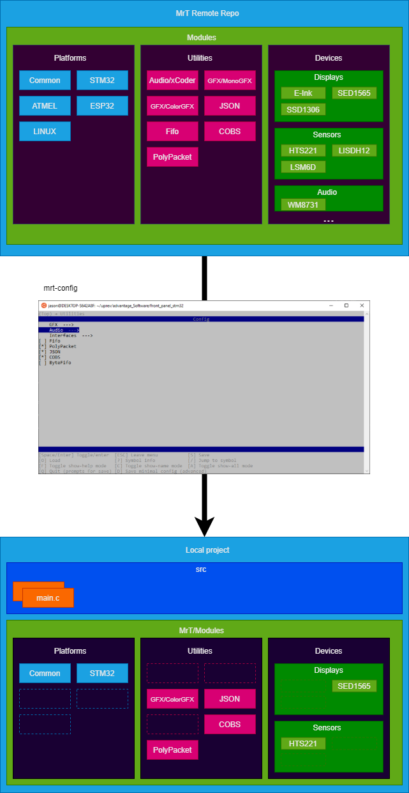

Architecture 
============

At its core ``MrT`` is just a git repository that contains a bunch of reusable submodules. mrt-config_ is just a tool that lets you browse submodules from that repo remotely, and add them to your own repo. 

Custom Remotes
--------------

By default mrt-config_ will use UpRev-MrT_ as the remote repo, but you can actually use any remote repo using the ``-r`` option. This allows users to maintain custom sets of modules and private repos. 

It works by parsing the ``.gitmodules`` file, so it will work with any repo that has submodules, there are no special files required.

mrt.yml files
-------------

Even though the tool will work on repos without any special files, ``mrt.yml`` files can extend the functionality. If you run the mrt-doc_ tool in the root of a repo, it will check all of the submodule paths in that repo for ``mrt.yml`` files and combine them into a root ``mrt.yml`` file. The main use for this is to gather all of the requirements for the submodules, so when you select one in the ``mrt-config`` tool, it can automatically select the dependencies. 

.. include:: ../../links.rst

