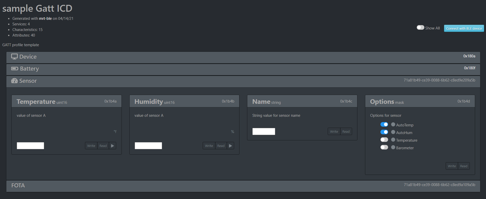

mrt-ble 
=======

``mrt-ble`` is a tool for creating gatt profile to use on BLE projects. It uses a yaml descriptor file to create C code and documentation for the Gatt profile. The generated Documentation includes a ``Live ICD`` which is a single page web app that can connect to the ``ble`` device and interact with the GATT Server. 

``mrt-ble`` is a tool in ``mrtutils``, so if that is not already installed, install it first: 

.. code-block:: bash 

    pip install mrtutils 

To get started, you can create a template: 

.. code-block:: bash 

    mrt-ble -t my_profile

`this will create a decriptor file my_profile.yml with an example profile filled out` 

Step 1: Define the profile
--------------------------

The Generated example descriptor file has comments to explaind the various fields. The overall structure is that each descriptor file creates a ``Profile``. A ``Profile`` is a group of ``Services``, and a ``Service`` is a group of related ``Characteristics``

Header Properties 
~~~~~~~~~~~~~~~~~

The beggining of the document contains properties for the profile . 

:name:          Name of Profile 
:description:   Description of Profile 
:prefix:        short prefix to append to profile structs and functions to avoid conflicts in code 

Services 
~~~~~~~~

Services can be custom, or imported from Bluetooth SIG standards using a URI. When importing from a SIG standard, all ``Mandatory`` Characteristics are automatically added, but optional ones must be specified. See the ``Device Service`` and ``Battery Service`` in the `Example file`_ for an example of this. 

Every service must have a prefix. And all custom services must have a ``UUID``. 

Optional properties:

:icon: named icon from `FontAwesome <https://fontawesome.com/icons?d=gallery&m=free>`_

Characteristics
~~~~~~~~~~~~~~~

Characteristics are individual fields in a ``Service``. In a SIG standard ``Service`` you can use the SIG standard ``Characteristics`` by specifying a URI.

Custom Characteristics must have a ``type``. this can be any of the following

+----------+----------------------------+
| Type     | Description                |
+==========+============================+
| uint8    |                            |
+----------+                            |
| uint16   |  Basic Unsigned Integer    |
+----------+           Types            |
| uint32   |                            |
+----------+                            |
| uint64   |                            |
+----------+                            |
| uint     |                            |
+----------+                            |
| char     |                            |
+----------+----------------------------+
| int8     |                            |
+----------+                            |
| int16    |   Basic Signed Integer     |
+----------+       Types                |
| int32    |                            |
+----------+                            |
| int64    |                            |
+----------+                            |
| int      |                            |
+----------+----------------------------+
| float    |        decimal types       |
+----------+                            |
| double   |                            |
+----------+----------------------------+
| string   | array of chars             |
+----------+----------------------------+
| Enum     | uint8 with named values.   |
|          | Each value gets a symbol   | 
|          | in code                    |
+----------+----------------------------+
| flags    | Bitmask with a defined     |
+----------+ symbol in code for         | 
| mask     | each bit. (maximum         | 
|          | of 32 bits in a            |
|          | Characteristic)            |
+----------+----------------------------+
| Array    | specified with             |
|          | <type>*<size>              |
|          | ex: uint16*32 is an array  |
|          | of 64 uint16 values        |
+----------+----------------------------+

Other properties in a ``Characteristic`` include:

Example File 
~~~~~~~~~~~~

.. code-block:: yaml

    ---
    name: sample
    author: Jason Berger
    created: 02/20/2020
    desc: GATT profile template
    prefix: tp

    services: #list multiple services in file to create full profile

    #########################################
    #        Device Service                 #
    #########################################
    - Device:
        uri: org.bluetooth.service.device_information #User URI of bluetooth sig standard service
        prefix: dev
        icon: fa-server #this isfor the live ICD (and completely optional). just adds an icon from here: https://fontawesome.com/icons?d=gallery&m=free
        chars:
            - {uri: org.bluetooth.characteristic.manufacturer_name_string , default: Up-Rev}  #list out uris of 'optional' desired chars
            - {uri: org.bluetooth.characteristic.serial_number_string}
            - {uri: org.bluetooth.characteristic.hardware_revision_string}
            - {uri: org.bluetooth.characteristic.firmware_revision_string, desc: Firmware revision} #You can override defaults from Bluetooth SIG (name,desc, perm, etc..)
    
    #########################################
    #        Battery Service                #
    #########################################
    - Battery: {uri: org.bluetooth.service.battery_service, prefix: bat} #no need to list chars, because the only one is Mandatory

    #########################################
    #        Sensor Service                 #
    #########################################
    - Sensor: 
        prefix: ss
        desc: Custom service for a Temperature/humidty sensor
        uuid: 71a8-1b49-ce39-0088-6b62-c8ed-9e20-9a5b 
        icon: fa-tachometer-alt
        chars: 
            # `unit` and `coef` are only used for displaying the values in the live ICD. They have no effect on the generated code 
            - Temperature: { type: uint16, perm: RWN, coef: 0.01, unit:  °f , desc: Temperature value in 1/100 of a degree farenheit} # uuid: 0x9e21 if uuid is blank/auto for first char in service. it will increment from service 16bit
            - Humidity: { type: uint16, perm: RWN , coef: 0.01, unit:  "%", desc: Humidity value in 1/100 of a percent} # uuid: 0x9e21 if uuid is blank/auto for first char in service. it will increment from service 16bit
            - Name: { type: string, perm: RW , desc: String value for sensor name} 
            - Options: 
                type: flags #flags create a bitmask for each item in 'vals'. All flags will have symbols in the code. The underlying data type is uint8_t, but will expand up to a uint32_t as needed
                perm: RW
                desc: Options for sensor
                vals:
                - AutoTemp: Auto update Temperature reading every 1 s
                - AutoHum: Auto update Temperature reading every 1 s
                - Temperature: Temperature sensor 
                - Barometer: Barometric Pressure sensor 

    
    #########################################
    #        Firmware OTA Service           #
    #########################################
    - FOTA:
        desc: sercive for performing over the air updates
        uuid: 71a8-1b49-ce39-0088-6b62-c8ed-9A10-9a5b
        prefix: ota
        chars:
            - version:    { type: string,   perm: RW, desc: current Firmware version}  # uuid: 0x9A11
            - newVerion:  {type: string,   perm: RW, desc: version of new firmware being loaded}    
            - data:       {type: uint8*64,  perm: RW, desc: current block of data} #array of 64 bytes
            - seq:        {type: uint32,    perm: RW, desc: sequence number of current block  }
            - crc:        {type: uint32,    perm: RW, desc: crc of new firmware  }
            - status:
                type: enum  
                perm: RW 
                desc: status of OTA process
                vals: 
                - IDLE:  no ota operation taking place
                - DOWNLOAD:  Currently downloading new firmware
                - COMPLETE:  Firmware download complete. ready to update

Step 2: Generate Code 
---------------------

Once you have the profile defined, you can generate the code with 

.. code-block:: bash 

    mrt-ble -i <yaml file> -o <output/path> -d <doc/path>

.. note:: regenerating the source code will **not** overwrite any code in the handler functions for the profile or services.

This will generate the following structure with source/header files:

| outputDir
| ├── svc 
| │   ├── dev_svc.h 
| │   ├── dev_svc.c
| │   ├── ss_svc.h 
| │   ├── ss_svc.c 
| │   ├── bat_svc.h 
| │   ├── bat_svc.c 
| │   ├── ota_svc.h 
| │   └── ota_svc.c
| ├── app_dev_svc.c      
| ├── app_ss_svc.c      
| ├── app_bat_svc.c      
| ├── app_ota_svc.c
| └── sample_profile.c/h

Step 3: Integrating Code
------------------------

The files in the ``svc`` folder are the low level descriptors and weakly defined handler functions. In most cases, there is no need to modify these files. 

The ``app_xx_svc.c`` files are for application level logic and contain the actual handler functions. This is where you will put in your logic for handling events for each characteristic. 

Each service will have an event handler for each ``Characteristic`` and a ``post_init`` handler. The ``post_init`` handler is called after the GATT server is initialized. This is where default values will be set. 

The ``Characteristic`` event handlers handle all events for a given ``Characteristic``. The ``mrt_gatt_evt_t`` struct contains the type of event [READ, WRITE,NOTIFY], as well as the raw data, and data size for the event. 

example handlers from app_dev_svc.c: 

.. code-block:: C 

    /* Post Init -----------------------------------------------------------------*/

    /**
    * @brief Called after GATT Server is intialized
    */
    void dev_svc_post_init_handler(void)
    {
        dvc_set_manufacturer_name("Up-Rev");    
        dvc_set_firmware_revision("0.1.9");
        dvc_set_serial_number("001");
    }

    /* Characteristic Event Handlers----------------------------------------------*/

    /**
    * @brief Handles GATT event on Manufacturer_Name Characteristic
    * @param event - ptr to mrt_gatt_evt_t event with data and event type
    */
    mrt_status_t dev_manufacturer_name_handler(mrt_gatt_evt_t* event)
    {
        if(event->mType == GATT_EVT_VALUE_WRITE)
        {
            char* val = ((char*) event->mData.data); /* Cast to correct data type*/
            MRT_PRINTF("Device name set to %s", val);
        }

        return MRT_STATUS_OK;
    }

.. note:: For more information on the mrt_gatt_evt_t struct, read the docs for the `gatt-server module <https://bitbucket.org/uprev/device-gatt-server/src/master/>`_

The source code and header for ``sample_profile.c`` contain the initialization funtion which will initialize all of the services. This function is called by the platform once the GATT server is up. This will vary from platform to platform so check the ``Platform`` documentation for how to implement this. But the most common method is to register the init function, before starting any bluetooth services. 

.. code-block:: C 

    MRT_GATT_REGISTER_PROFILE_INIT(sample_profile_init);

Once the function is registered, it is up to the Platform layer to call the function at the appropriate time. 

Live ICD 
--------

Once your GATT profile is running on the target device, it is useful to be able to interact with it for testing and development. When the code is generated with documentation it produces 2 files. The first is a plain text ICD for documentation, and the second is a ``Live ICD``. This is a single page web app which can connect to the device over BLE and provide a GUI for interacting with the device. 

