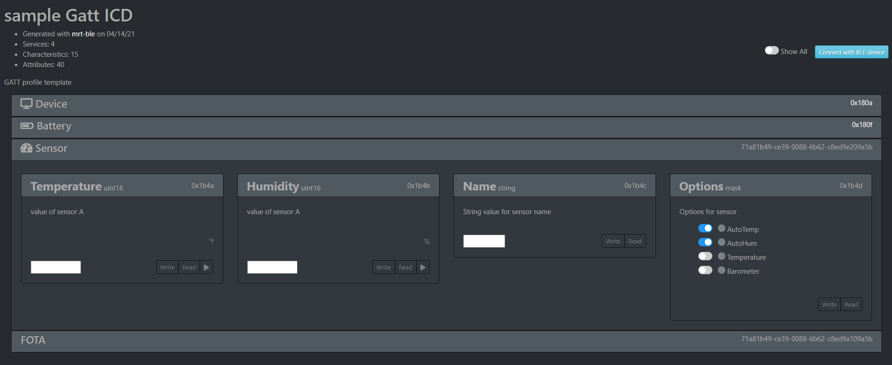

mrt-ble 
=======

``mrt-ble`` is a tool for creating gatt profile to use on BLE projects. It uses a yaml descriptor file to create C code and documentation for the Gatt profile. The generated Documentation includes a ``Live ICD`` which is a single page web app that can connect to the ``ble`` device and interact with the GATT Server. 

``mrt-ble`` is a tool in ``mrtutils``, so if that is not already installed, install it first: 

.. code-block:: bash 

    pip install mrtutils 

To get started, you can create a template: 

.. code-block:: bash 

    mrt-ble -t my_profile

`this will create a decriptor file my_profile.yml with an example profile filled out` 

Descriptor File 
---------------

The Generated example descriptor file has comments to explaind the various fields. The overall structure is that each descriptor file creates a ``Profile``. A ``Profile`` is a group of ``Services``, and a ``Service`` is a group of related ``Characteristics``

Header Properties 
~~~~~~~~~~~~~~~~~

The beggining of the document contains properties for the profile . 

:name:          Name of Profile 
:description:   Description of Profile 
:prefix:        short prefix to append to profile structs and functions to avoid conflicts in code 

Services 
~~~~~~~~

Services can be custom, or imported from Bluetooth SIG standards using a URI. When importing from a SIG standard, all ``Mandatory`` Characteristics are automatically added, but optional ones must be specified. See the ``Device Service`` and ``Battery Service`` in the `Example file`_ for an example of this. 

Every service must have a prefix. And all custom services must have a ``UUID``. 

Optional properties:

:icon: named icon from `FontAwesome <https://fontawesome.com/icons?d=gallery&m=free>`_

Characteristics
~~~~~~~~~~~~~~~

Characteristics are individual fields in a ``Service``. In a SIG standard ``Service`` you can use the SIG standard ``Characteristics`` by specifying a URI.

Custom Characteristics must have a ``type``. this can be any of the following

+----------+----------------------------+
| type     | Description                |
+==========+============================+
| uint8    |                            |
+----------+                            |
| uint16   |  Basic Unsigned            |
+----------+                            |
| uint32   |       Types                |
+----------+                            |
| uint     |                            |
+----------+                            |
| char     |                            |
+----------+----------------------------+
| int8     |                            |
+----------+                            |
| int16    |   Basic Signed             |
+----------+       Types                |
| int32    |                            |
+----------+                            |
| int      |                            |
+----------+----------------------------+
| string   | array of chars             |
+----------+----------------------------+
| Enum     | uint8 with named values.   |
|          | Each value gets a symbol   | 
|          | in code                    |
+----------+----------------------------+
| flags    | Bitmask with a defined     |
+----------+ symbol in code for         | 
| mask     | each bit. (maximum         | 
|          | of 32 bits in a            |
|          | Characteristic)            |
+----------+----------------------------+
| Array    | specified with             |
|          | <type>*<size>              |
|          | ex: uint16*32 is an array  |
|          | of 64 uint16 values        |
+----------+----------------------------+

Other properties in a ``Characteristic`` include:

Example File 
~~~~~~~~~~~~

.. code-block:: yaml

    ---
    name: sample
    author: Jason Berger
    created: 02/20/2020
    desc: GATT profile template
    prefix: tp

    services: #list multiple services in file to create full profile

    #########################################
    #        Device Service                 #
    #########################################
    - Device:
        uri: org.bluetooth.service.device_information #User URI of bluetooth sig standard service
        prefix: ds
        icon: fa-server #this isfor the live ICD (and completely optional). just adds an icon from here: https://fontawesome.com/icons?d=gallery&m=free
        chars:
            - {uri: org.bluetooth.characteristic.manufacturer_name_string , default: Up-Rev}  #list out uris of 'optional' desired chars
            - {uri: org.bluetooth.characteristic.serial_number_string}
            - {uri: org.bluetooth.characteristic.hardware_revision_string}
            - {uri: org.bluetooth.characteristic.firmware_revision_string, desc: Firmware revision} #You can override defaults from Bluetooth SIG (name,desc, perm, etc..)
    
    #########################################
    #        Battery Service                #
    #########################################
    - Battery: {uri: org.bluetooth.service.battery_service, prefix: bat} #no need to list chars, because the only one is Mandatory

    #########################################
    #        Sensor Service                 #
    #########################################
    - Sensor: 
        prefix: ss
        desc: Custom service for a Temperature/humidty sensor
        uuid: 71a8-1b49-ce39-0088-6b62-c8ed-9e20-9a5b 
        icon: fa-tachometer-alt
        chars: 
            # `unit` and `coef` are only used for displaying the values in the live ICD. They have no effect on the generated code 
            - Temperature: { type: uint16, perm: RWN, coef: 0.01, unit:  °f , desc: Temperature value in 1/100 of a degree farenheit} # uuid: 0x9e21 if uuid is blank/auto for first char in service. it will increment from service 16bit
            - Humidity: { type: uint16, perm: RWN , coef: 0.01, unit:  "%", desc: Humidity value in 1/100 of a percent} # uuid: 0x9e21 if uuid is blank/auto for first char in service. it will increment from service 16bit
            - Name: { type: string, perm: RW , desc: String value for sensor name} 
            - Options: 
                type: flags #flags create a bitmask for each item in 'vals'. All flags will have symbols in the code. The underlying data type is uint8_t, but will expand up to a uint32_t as needed
                perm: RW
                desc: Options for sensor
                vals:
                - AutoTemp: Auto update Temperature reading every 1 s
                - AutoHum: Auto update Temperature reading every 1 s
                - Temperature: Temperature sensor 
                - Barometer: Barometric Pressure sensor 

    
    #########################################
    #        Firmware OTA Service           #
    #########################################
    - FOTA:
        desc: sercive for performing over the air updates
        uuid: 71a8-1b49-ce39-0088-6b62-c8ed-9A10-9a5b
        prefix: ota
        chars:
            - version:    { type: string,   perm: RW, desc: current Firmware version}  # uuid: 0x9A11
            - newVerion:  {type: string,   perm: RW, desc: version of new firmware being loaded}    
            - data:       {type: uint8*64,  perm: RW, desc: current block of data} #array of 64 bytes
            - seq:        {type: uint32,    perm: RW, desc: sequence number of current block  }
            - crc:        {type: uint32,    perm: RW, desc: crc of new firmware  }
            - status:
                type: enum  
                perm: RW 
                desc: status of OTA process
                vals: 
                - IDLE:  no ota operation taking place
                - DOWNLOAD:  Currently downloading new firmware
                - COMPLETE:  Firmware download complete. ready to update

Generated Code 
--------------

Live ICD 
--------

